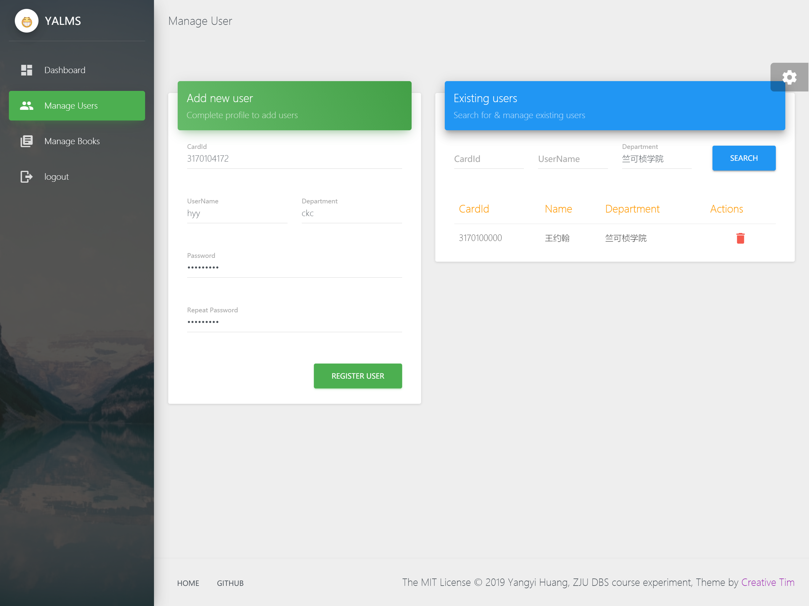
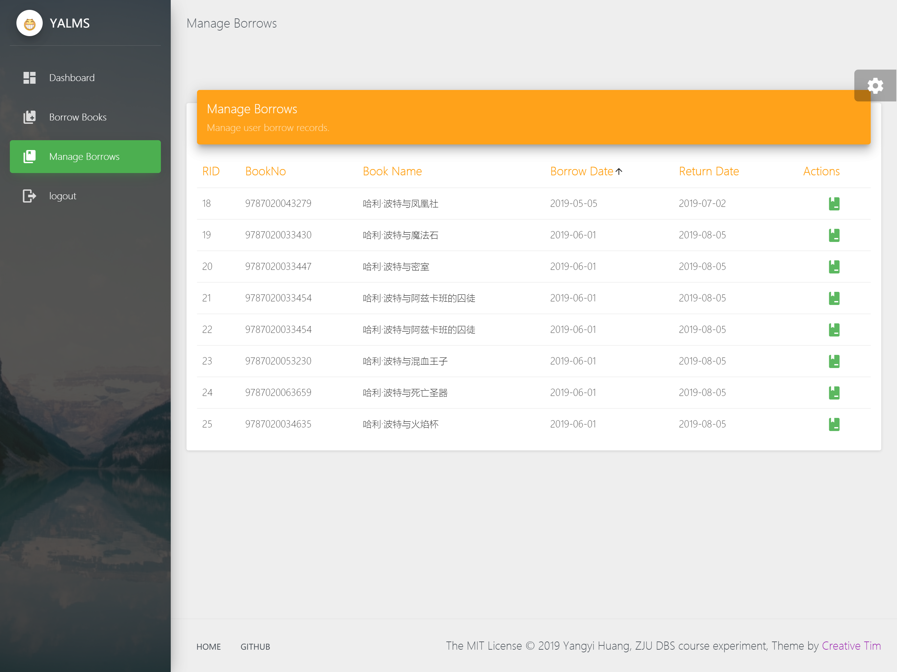

# 实验5 数据库程序设计

<div style="float:right">混合1701 黄洋逸 3170104172<br>
    <a href="https://github.com/13lank/YALMS">项目Github页</a>
    <br>
</div>


## 实验目的与要求：

### 实验目的

设计并实现一个精简的图书管理系统，要求具有图书入库、查询、借书、还书、借书证管理等功能。通过该图书馆系统的设计与实现，提高学生的系统编程能力，加深对数据库系统原理及应用的理解。

### 实验要求

1. 管理基本数据对象
2. 实现基本功能模块
3. 实现用户界面
4. 数据库平台：SQL Server或MySQL
5. 开发工具：任选编程语言

### 实验平台开发工具

1. 编程语言：TypeScript(node后端), JavaScript(前端)
2. Web框架：Koa2(后端), Vue.js(前端)
3. ORM框架：TypeOrm
4. 数据库：MySQL 5.7
5. 其他开发工具：Visual Studio Code, @Vue/CLI(前端脚手架)

## 总体设计


### 工程架构与开发技术概述

考虑到图书管理系统的实际使用场景，本实验中笔者采用了B/S架构的模式来进行开发，具有基于Web开发的跨平台、多终端、对异步的更好支持等优势。

前端部分使用了[Vue.js](cn.vuejs.org)框架进行开发：Vue.js是一套用于构建用户界面的渐进式框架，具有数据驱动和组件化的设计特点。由于上手较简单，没有开发过Web应用程序的笔者决定借此契机先从这一框架进行一些简单的尝试~~真香~~。前端界面由基于[Vuetify](vuetifyjs.com)组件框架的开源模板[Vuetify Material Dashboard](https://github.com/creativetimofficial/vuetify-material-dashboard)魔改而来，具有比较美观的视觉效果和比较友好的交互方式。

后端部分使用了[TypeORM](typeorm.github.io)作为数据库的ORM框架进行开发。ORM即对象关系映射模式是一种通过描述对象（实体）和数据库之间描述的元数据，将程序中的对象（实体）自动持久化到数据库中的技术；使用ORM框架与数据库进行交互的好处在于能够精准建模实体数据，其数据模型所反映的实体与实体间的关系更加清晰易于理解。TypeORM是基于TypeScript的ORM框架，受益于TypeScript的强类型性，使用TypeORM开发数据库程序可以使用类型推导协助开发~~用VS Code写ts真爽~~、且能保证数据库操作中的类型安全。另外后端应用架构Koa.js（其实如果要做到使用TS开发的一致性，应当使用Nest.js架构，但后端框架在数据库实验中并不是重点，所以从简），但后端部分整体是完全用TypeScript语言进行开发的。

#### 架构图


### 实现功能介绍

功能模块 | 具体功能描述
- | -
用户/管理员登陆 | 通过学号/用户名和密码以不同的身份登陆系统，以session方式记录登陆状态
用户管理 | 管理员可以显示、查找、注册、删除系统中的用户
图书查找 | 通过模糊搜索、字段信息查询的方式查找图书
图书管理 | 管理员可以对图书进行单本添加或者用上传.csv文件批量添加；可以对现有图书进行删除
图书借阅&归还 | 用户可以在查询过程中一键借阅图书；可以看到自己目前借阅情况并进行一键归还
图书排行榜 | 在首页显示一个按借阅数量排名的热门图书榜
用户排行榜 | 在首页显示一个按借阅数量排名的用户排行榜

#### Highlighted Features:

1. 使用了加盐Hash的密码储存-校验方式用以替代危险的明文密码储存
2. 后端API对于不同角色的权限管理确保了数据安全
2. 图书和用户查找界面中能直接实现对相关条目的一键管理、修改、借阅归还等操作
3. Dashboard首页界面对图书馆信息的概览与用户、图书排行榜
4. 支持模糊搜索和字段检索的图书搜索功能，更便于用户操作
6. ORM对SQL注入攻击有一定的防御能力

### 实体关系模型设计与数据库表设计

本系统的实体及其属性，实体间的关系如以下图表所示：


由于使用ORM模式进行数据库开发，下面简单就实际表格字段与实体定义做对比性的介绍。
#### Admin管理员

Admin即管理员账户的信息记录，对应数据库的`admin`表格

字段名 | 作用
- | -
AdminName | 管理员账户名（用于登陆）
Contact | 管理员联系方式
PwdHash | 密码哈希值
PwdSalt | 密码哈希所用盐值

在TypeORM中对应的Entity定义如下：
```typescript
@Entity()
export class Admin {

  @PrimaryColumn({ type: "nvarchar", charset: "utf8mb4" })
  AdminName: string;

  @Column({ type: "nvarchar", charset: "utf8mb4" })
  Contact: string;

  @Column({ type: "nvarchar", charset: "utf8mb4" })
  PwdHash: string;

  @Column({ type: "nvarchar", charset: "utf8mb4" })
  PwdSalt: string;

}
```

#### User用户

User即普通用户账户，对应数据库`user`表格
字段名 | 作用
- | -
CardId | 借阅证编号（用于登陆）
Name | 姓名
Dept | 所属院系
PwdHash | 密码哈希值
PwdSalt | 密码哈希所用盐值

在TypeORM中对应的Entity定义如下：
```typescript
@Entity()
export class User {

    @PrimaryColumn({ type: "char", length: 10 })
    CardId: string; 

    @Column({ type: "nvarchar", charset: "utf8mb4" })
    Name: string; 

    @Column({ type: "nvarchar", charset: "utf8mb4" })
    Dept: string; 

    @Column({ type: "nvarchar", charset: "utf8mb4" })
    PwdHash: string; 

    @Column({ type: "nvarchar", charset: "utf8mb4" })
    PwdSalt: string; 

    @OneToMany(type => Record, Record => Record.User, { cascade: true })
    Records: Record[];

}
```
其中`@OneToMany`一列表示用户与借阅记录的一对多关系，使用`cascade`的自动更新策略。

#### Book图书

Book即图书馆中所存图书，对应数据库`book`表格
字段名 | 作用
- | -
BookNo |图书ISBN编码
BookName | 图书名
Author | 作者名
Publisher | 出版者
CreateDate | 入库日期
Price | 价格
Storage | 库存
Total | 总量
在TypeORM中对应的Entity定义如下：
```typescript
@Entity()
export class Book {

  @PrimaryColumn({ type: "char", length: 13 })//using ISBN-13, e.g. "9780136019701"
  BookNo: string;

  @Column({ type: "nvarchar", charset: "utf8mb4" })
  BookName: string;

  @Column({ type: "nvarchar", charset: "utf8mb4" })
  BookType: string;

  @Column({ type: "nvarchar", charset: "utf8mb4" })
  Author: string;

  @Column({ type: "nvarchar", charset: "utf8mb4" })
  Publisher: string;

  @CreateDateColumn()
  CreateDate: string;

  @Column("float")
  Price: number;

  @Column("int")
  Storage: number;

  @Column("int")
  Total: number;

  @OneToMany(type => Record, Record => Record.Book, { cascade: true })
  Records: Record[];

}
```
对于`BookNo`做出了长度限制

对于`CreateDate`一列使用了TypeORM的自动生成列功能，创建行的时候会获取当前日期作为`CreateDate`

其中`@OneToMany`一列表示图书与借阅记录的一对多关系，使用`cascade`的自动更新策略。

#### Record借阅记录

Record即用户借阅图书的借阅记录，对应数据库中的`record`表格

字段名 | 作用
- | -
RID | 记录编号
LentDate | 借阅日期
ReturnDate | 最迟归还日期
Returned | 是否已归还
userCardId | 对应用户借书证编号
bookBookNo | 对应图书ISBN号

在TypeORM中对应的Entity定义如下：
```typescript
import { Entity, PrimaryGeneratedColumn, Column, ManyToOne, OneToMany } from 'typeorm';
import { User } from './User'
import { Book } from './Book'

@Entity()
export class Record {

  @PrimaryGeneratedColumn()
  RID: number;

  @Column("date")
  LentDate: string;

  @Column("date")
  ReturnDate: string;

  @Column("boolean")
  Returned: boolean;

  @ManyToOne(type => User, User => User.Records, { onDelete: 'CASCADE' })
  User: User;

  @ManyToOne(type => Book, Book => Book.Records, { onDelete: 'CASCADE' })
  Book: Book;

}
```
其中两列`@ManyToOne`表示`Record`与`User`/`Book`之间的一对多关系，在表中表现为`User`/`Book`的Primary Key(Column)，即`userCardId`与`bookBookNo`

`@ManyToOne`修饰器中将`onDelete`操作设为级联删除，即当一个`record`对应的`user`或`book`被删除时，其本身也会被删除。

## 功能展示与具体实现

由于有关数据库的具体操作主要在后端中实现，且前端部分代码多为界面组件的设计以及调用后端API的函数；在这一部分笔者主要围绕后端API代码进行功能实现的具体介绍，前端部分主要以展示为主，仅结合部分关键函数代码。

### 前端实现与展示

前端的实现主要是在现有模板的基础上，重新为页面添加需要使用的`components`，为每个`view`中需要用到的函数和数据编写相关的Js代码，实现的功能以操作页面元素和从后端API获取数据或向其提交数据为主。

打开网页应用，首先呈现给用户的就是我们的图书馆概览信息。


点击Login，切换到登陆界面，在登陆界面可以使用用户或管理员身份登陆。部分关键代码如下：


点击ADMIN LOGIN，进入管理员视图；管理员视图由Manage Users和Manage Books组成



Manage Users界面中，我们可以通过字段信息对用户进行查找，并可以方便地一键删除该用户（并清除该用户的借阅记录等信息）。注册用户的界面同时也设计在这一页面，为了防止错误设置密码，特意设计了重复密码这一经典手段。


Manage Books界面中除了与Manage User类似的填写字段信息->添加或查询的功能模式，还加入了模糊检索与批量添加的功能。点击ADD BOOKS FROM FILE后，会弹出让用户选择.csv表格文件的对话框，选择合法文件后，前端将会将其转换为JSON格式，调用后端API进行批量添加。

点击Logout，用户登出，弹出登出提示。


再次以普通用户身份登陆，进入user视图；user视图由Borrow Books与Manage Borroows组成。


Borrow Books界面中，用户可以通过与Manage Books类似的交互方式对书籍进行一键借阅。如果图书存量不足，网页会弹出警告框提示


在Manage Borrows界面，用户可以看到自己目前的借阅情况。（仅显示未归还的记录）



表格中右边也有一件归还的按钮，如果归还成功，网页也会弹出提示：


### 后端实现

除了前文所介绍的TypeORM所需的若干`Entity`定义代码文件外，后端代码主要由若干树形结构的`Router`路由和管理访问权限的`auth`中间件组成。路由与中间件的树形关系如下：

#### 授权管理

为了方便授权管理，这里将API分为了`common`和`admin`两部分，前者普通用户可以调用，后者只有管理员可以调用。`auth`中间件通过读取session中的登陆信息和访问API的路径进行判断，决定是否放行。

```typescript
module.exports = async (ctx, next) => {
  if (ctx.url.slice(0, 6) === '/admin') {
    if (ctx.session.admin !== undefined) await next();
    else ctx.body = {
      "status": false,
      "info": "No Permission"
    }
    return;
  }
  else {
    await next();
    return;
  }
}
```

#### 用户机制

首先是admin下的用户管理API，`register`,`allusers`,`delete`,`search`四个API分别提供了用户注册、获取所有用户信息、删除用户、查找用户四个功能。

##### 用户注册

前端将用户的注册信息以POST请求发送到后端，首先生成随机字符串作为密码的Salt,再对密码Hash值进行处理，把这两个值作为验证密码的手段储存在数据库中。

TypeORM中，我们可以以创建新对象的方式来创建一个新的实体，设置其各字段属性，获取数据库连接后使用TypeORM的`manager`模式插入到相应表格中，代码如下：
```typescript
userRouter.post('/register', async (ctx) => {
  const data = ctx.request.body;
  console.log("Creating user:", data);
  try {
    let user = new User();
    user.Name = data['Name'];
    user.PwdSalt = genSalt();
    user.PwdHash = sha512(data['Password'], user.PwdSalt);
    user.Records = [];
    user.Dept = data['Dept'];
    user.CardId = data['CardId'];
    await getConnection().manager.save(user);
    ctx.body = { 'status': true, 'info': "User Created! CardId: " + user.CardId };
  }
  catch (err) {
    console.log("Failed to create user:", err);
    ctx.body = { 'status': false, 'info': err };
  }
});
```

##### 用户查找

由于只涉及对于`User`一种实体的操作，因此我们可以使用TypeORM中的`Repository`方式进行`User`的查询。

`allusers`直接使用无条件的`find()`即可；`search`涉及到`LIKE`语句的使用，需要用构建复杂查询的`QueryBuilder`实现；使用`QueryBuilder`进行查询与一般的SQL语句在形式上更为相似，可以对其中的一部分或整个查询使用SQL语句的语法；在用户查询中，我们会返回所有对应字段含有输入关键字的用户信息，所以需要对查询的`WHERE`后的描述字符串进行构造。

```typescript
userRouter.get('/allusers', async (ctx) => {
  console.log("Querying all user info...");
  try {
    let userRepository = getConnection().getRepository(User);
    let allUsers = await userRepository.find();
    console.log("Query succeeded!");
    ctx.body = { 'status': true, 'info': allUsers };
  }
//...

userRouter.get('/search', async (ctx) => {
  try {
    var params = ctx.query;
    var qstr = "";
    for (var key in params)
      qstr += "`" + key + "` LIKE \'%" + params[key] + "%\' AND ";
    if (qstr.length > 3) qstr = qstr.slice(0, -4);
    console.log(qstr);
    const userres = await getConnection().getRepository(User)
      .createQueryBuilder('User').where(qstr).getMany();
    var res = [];
    for (var user of userres) {
      res.push({
        CardId: user.CardId,
        Name: user.Name,
        Dept: user.Dept
      })
    }
    ctx.body = { 'status': true, 'res': res };
  }
//...
```

`search`中选择部分字段返回的操作也可以通过数据库查询中的`VIEW`（视图）实现。

##### 用户登录

由于用户登陆前没有管理员权限，所以我们需要把这部分API放到`\common`路径下。

用户登录和管理员登录是分开的，总体机制类似，先通过查询用户信息获得`PwdSalt`与`PwdHash`，在将`Salt`和输入的密码进行一次`Hash`进行比对。

用户登陆成功后，脱敏的登陆信息会被保存在`session`中。

因为前端的Js代码不能直接读取`session`，提供了一个`status`API用以查询登陆状态。

登出操作只要通过清空`session`相应成员即可实现。

```typescript
//userlogin
//...
    const userRepo = getConnection().getRepository(User);
    let targetUser = await userRepo.findOneOrFail({ CardId: data.CardId })
      .catch(err => {
        throw "User not found, CardId:" + data.CardId;
      });
    let PwdHash = sha512(data.Password, targetUser.PwdSalt);
    if (PwdHash !== targetUser.PwdHash) throw "Wrong Password";
    ctx.session.admin = undefined;
    ctx.session.user = targetUser;
//...

//userlogin
//...
    const adminRepo = getConnection().getRepository(Admin);
    let targetAdmin = await adminRepo.findOneOrFail({ AdminName: data.AdminName })
      .catch(err => {
        throw "Admin not found, AdminName:" + data.AdminName;
      });
    let PwdHash = sha512(data.Password, targetAdmin.PwdSalt);
    if (PwdHash !== targetAdmin.PwdHash) throw "Wrong Password";
    ctx.session.admin = targetAdmin;
    ctx.session.user = undefined;
//...

loginRouter.post('/logout', async ctx => {
  ctx.session.admin = undefined;
  ctx.session.user = undefined;
  console.log("Logout succeeded!");
  ctx.body = { 'status': true, 'info': "Logout succeeded!" };
})

loginRouter.get('/status', async ctx => {
  if (ctx.session.admin !== undefined) {
    ctx.body = {
      'status': true, 'type': 'admin', 'userinfo': {
        'AdminName': ctx.session.admin.AdminName
      }
    };
  }
  else if (ctx.session.user !== undefined) {
    ctx.body = {
      'status': true, 'type': 'user', 'userinfo': {
        'CardId': ctx.session.user.CardId,
        'Name': ctx.session.user.Name
      }
    };
  }
  else ctx.body = {
    'status': false
  };
})
```

#### 图书相关机制

图书相关机制部分分为图书查询和图书管理两个部分。

##### 图书查询

图书查询分为两种查询方式：一种是通过查询符合各字段信息包含相应关键字的详细信息查询；一种是通过单个关键词字符串进行的模糊查询。详细信息查询的方式同上文中提过的用户查找方式基本一致，此处不做赘述。

模糊查询是利用SQL语句中的`CONCAT`运算符实现的，`CONCAT`可以将各字段的信息连接成一个字符串的新字段并利用其进行查询；将ISBN、书名、出版者、作者等信息连接起来，再配合上文所说的`LIKE`语句使用，就可以达到模糊查询的效果。核心实现代码如下：

```typescript
//searchfuzzy
//...
    const res = await getConnection()
          .getRepository(Book)
          .createQueryBuilder("book")
          .where("CONCAT\(`BookNo`,`BookName`,`BookType`,`Author`,`Publisher`\) LIKE :pattern", { pattern: '%' + keyword + '%' })
          .getMany();
        console.log("Search Succeeded with", res.length, res.length > 1 ? "books" : "book");
        ctx.body = { 'status': true, 'res': res };
//...
```

##### 图书管理

图书管理部分有两个API，分别负责添加（批量）图书和删除现有图书

添加图书的API可能会被前端的两种动作调用，一种是在表单中填写单本图书的信息并提交，一种在前端进行csv文件的上传和解析，再以JSON格式发送到后端进行添加。因而此处的后端代码与添加用户的代码相似，也使用了`manager`模式，值得一提的是`.save`函数可以一次性添加多个`Entities`，确保了多行数据插入时的原子性。

```typescript
//addbooks
//...
	let books = []
    for (var item of data) {
      let book = new Book();
      for (var keys in item) book[keys] = item[keys];
      book.Storage = item['Total'];
      book.Records = [];
      books.push(book)
    }
    await getConnection().manager.save(books);
//...
```

删除现有图书传入的参数是图书的编号，具体删除方式是通过先查询再删除的方式实现的。

```typescript
//delete
//...
	let bookRepository = getConnection().getRepository(Book);
    const target_book = await bookRepository.findOne({ BookNo: BookNo });
    bookRepository.remove(target_book);
//...
```

#### 借阅归还机制

##### 图书借阅与归还

用户触发借阅时，前端会想后端API发送POST请求，里面有图书的编号作为参数。图书借阅在数据库查询中分为三步进行：第一步先查找对应编号的图书实体；然后使用`update`对其在`book`表中的`Storage`属性进行自减；最后创建新的`Record`实体，用当前session中存储的`user`和第一步查询所得的`book`作为两个多对一关系的另一实体，用`repository`的方式将其插入到数据库的`record`表中。

```typescript
//borrow
//...
    const target_book = await bookRepo.findOneOrFail({ BookNo: BookNo })
          .catch(err => {
            throw "Book Not Found, BookNo: " + BookNo;
          });//查询目标图书
        if (target_book.Storage === 0) throw "Not Enough Storage, BookNo: " + BookNo;
        await bookRepo.update({ BookNo: target_book.BookNo }, { Storage: (target_book.Storage - 1) }).catch(err => {
          console.log(err);
          throw "update failed";
        });//更新Storage
        const record = new Record();
        record.Book = target_book;
        record.User = ctx.session.user;
        var date = new Date();
        record.LentDate = date.getFullYear() + '-' + (date.getMonth() + 1) + '-' + date.getDay();
        date.setDate(date.getDate() + 60);
        record.ReturnDate = date.getFullYear() + '-' + (date.getMonth() + 1) + '-' + date.getDay();
        record.Returned = false;
        await recordRepo.save(record);//插入记录
//...
```

图书归还则较为简单，由于用户是从其借阅记录中选择归还的，我们只需要查找其对应编号的借阅记录，并将其归还状态`returned`赋值为`true`；Typeorm中可以在查询时同时查询某一实体关系中对应的其他实体的信息，我们再将该记录关系所对应的`book`的`Storage`自增即可。

```typescript
//return 
//...
    let record = await recordRepo.findOneOrFail({
          where: { RID: data.RID },
          relations: ["User", "Book"]
        });
        if (record.User.CardId !== ctx.session.user.CardId) throw "Invalid User";
        if (record.Returned !== false) throw "Already returned";
        await recordRepo.update({ RID: data.RID }, { Returned: true });
        await bookRepo.update({ BookNo: record.Book.BookNo }, { Storage: () => "`Storage`+1" });
//...
```

##### 图书借阅情况查询

由于session中已经保存了用户的信息，我们将这个API设计成GET请求的模式，查找并返回`record`表中`status`为`false`，`user`为对应用户的所有`record`所对应的`book`的信息。这一操作使用我们之前所讲的查询时附带`relation`信息的方式可以很方便的完成。

```typescript
//user_rent_status
//...
    let res = await recordRepo.find({
      where: { User: ctx.session.user, Returned: false },
      relations: ["Book"]
    });
//...
```

#### 图书馆概览信息获取

应用首页Dashboard显示的图书馆概览信息主要有图书的总册数，总借阅记录数和总用户数，以及借阅记录数排名前10的用户和图书。

总数量的查询非常简单，只需要用`Repository`中的`count`即可，相当于SQL语句中的`COUNT`，例如：

```typescript
const res = await getConnection().getRepository(Record).count();
```

排名前十的用户和图书需要用到嵌套子查询，`COUNT`，`GROUP BY`，`ORDER BY`等多种SQL语法，是一个较为复杂的查询，因此我在此处选择完全使用SQL语句进行查询，如下：

```typescript
//top_users
//...
const res = await getConnection().query(
	"select `user`.Name,`user`.Dept,`user`.CardId,a.Borrows \
    from `user`,(select userCardId, COUNT(*)as Borrows \
    			from `record` \
                GROUP BY userCardId) as a \
                where (`user`.CardId = a.userCardId) \
    order by Borrows desc \
    limit 0,10"
    );       
/...
```

排名前十的图书查询实现与用户查询也类似

